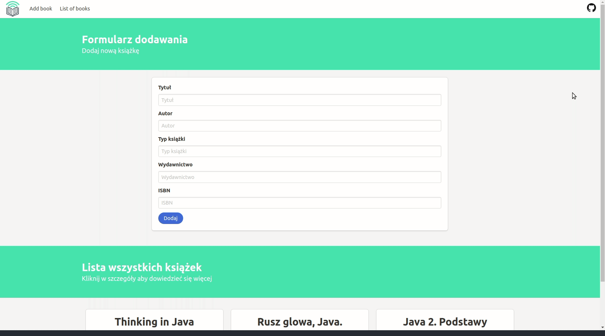

# Book-creator-using-REST-API
>The purpose of creating the program is to write a functional frontend application for cataloging books by the REST method.

## Used
+ [Maven](https://maven.apache.org/)
+ [Spring](https://spring.io/)
+ [jQuery](https://jquery.com/)
+ [Bulma](https://bulma.io/)

## Presentation
